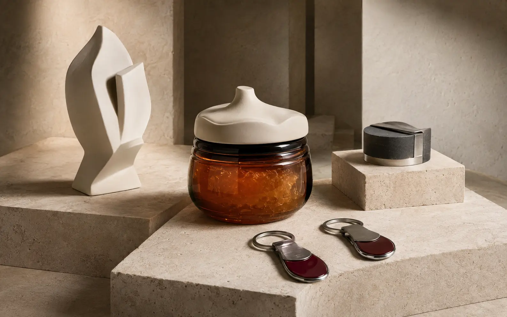
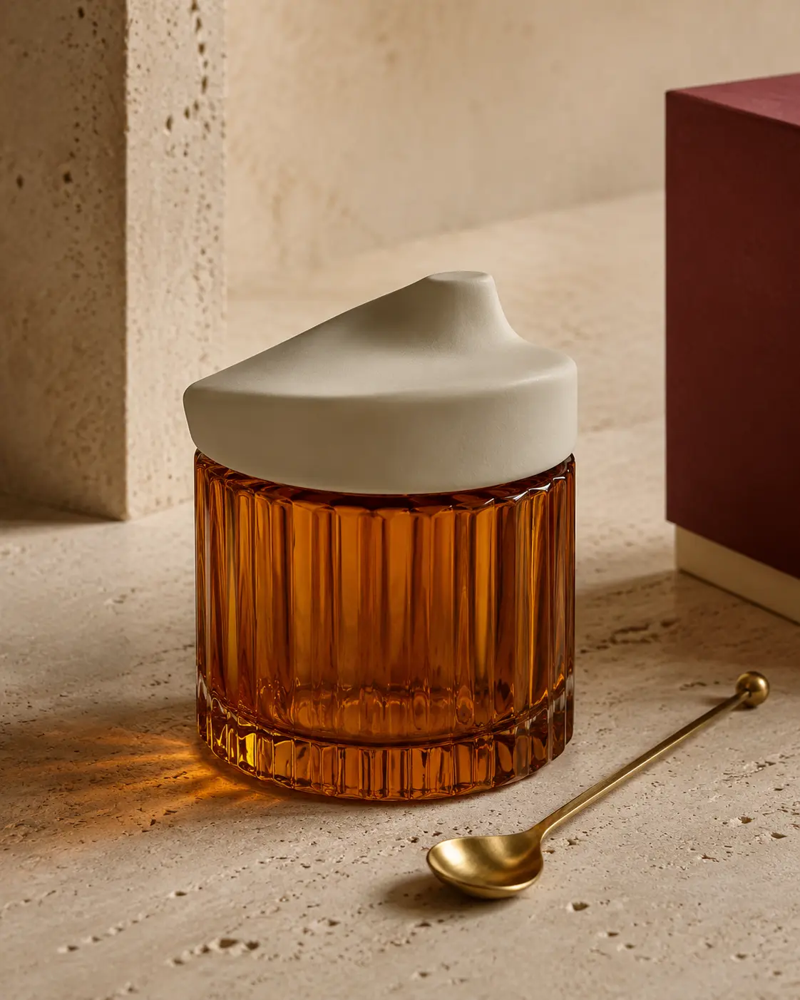
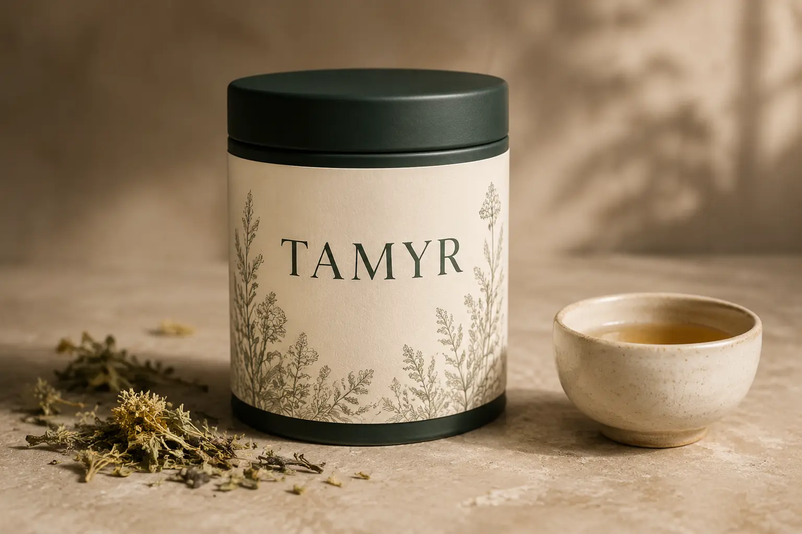
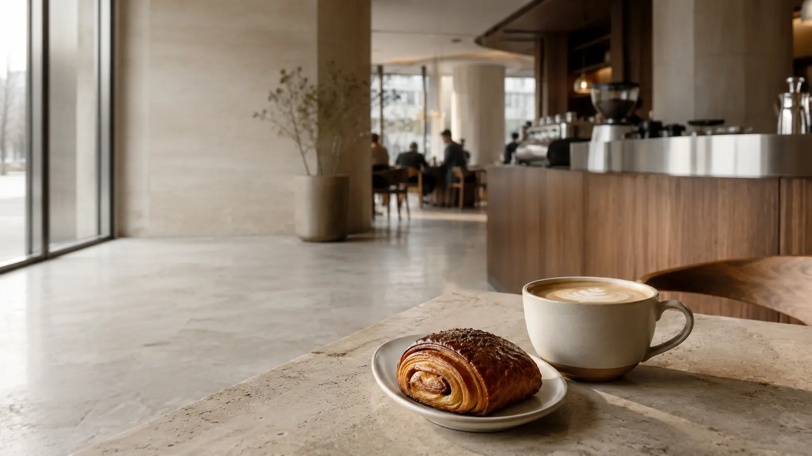
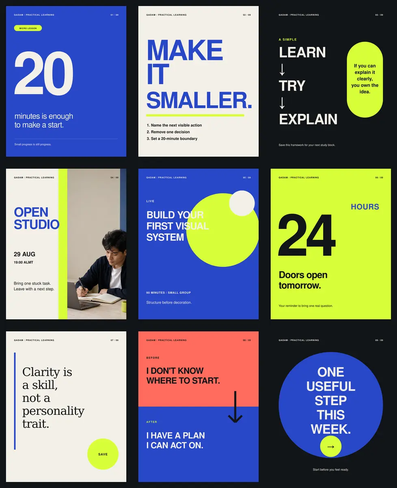

# Ulyana Chistyakova

### Visual and object design for small businesses

Brands people notice. Objects people want to keep.

[Open the portfolio](https://ulyana-visual-portfolio.leonid-chistyakov.chatgpt.site) · [Русский](README_RU.md) · [Қазақша](README_KZ.md)

## Four self-initiated cases

### 01. MURA Object Editions

An object collection connecting a figurine, a collectible honey jar, keychains and a gift object through one silhouette and material system.

### 02. TAMYR Botanical Tea

A botanical tea packaging concept developed from two directions into a selected route, front and back labels, visualization and honest pre-production boundaries.

### 03. SAULE Coffee House

A twelve-slide presentation system built around one argument per slide, a clear narrative and consistent visual logic.

### 04. QADAM Learning Studio

A nine-template content system designed to remain recognizable when the subject, message and format change.

## What the portfolio demonstrates

- art direction and visual systems;
- object concepts and collectible products;
- packaging and labels;
- presentations and documents;
- content and template systems;
- structured client handoff;
- a clear distinction between concept design and production readiness.

Every project is self-initiated. No fictional client, testimonial, sale or commercial result is presented as real.

## Portfolio protection

This public edition is provided solely for portfolio viewing and evaluation. Editable source files, working documents, specifications and client kits are stored privately and supplied only within an agreed paid project.

© 2026 Ulyana Chistyakova. All rights reserved. Copying, republication, resale, commercial use or presenting this work as one's own is prohibited without prior written permission.
